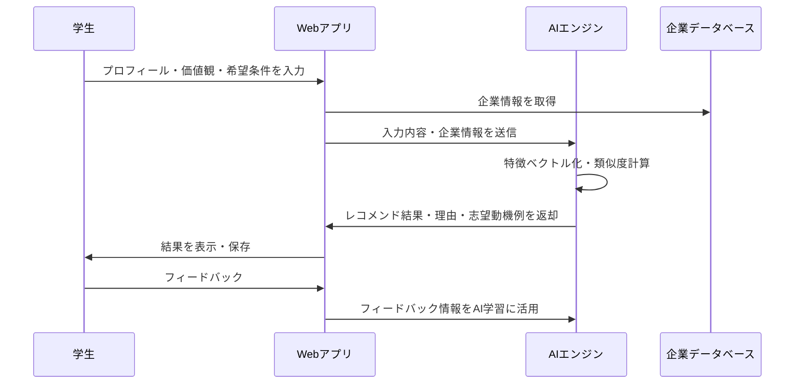

```mermaid
sequenceDiagram
    participant U as 学生
    participant W as Webアプリ
    participant A as AIエンジン
    participant D as 企業データベース

    U->>W: プロフィール・価値観・希望条件を入力
    W->>D: 企業情報を取得
    W->>A: 入力内容・企業情報を送信
    A->>A: 特徴ベクトル化・類似度計算
    A->>W: レコメンド結果・理由・志望動機例を返却
    W->>U: 結果を表示・保存
    U->>W: フィードバック
    W->>A: フィードバック情報をAI学習に活用
```
