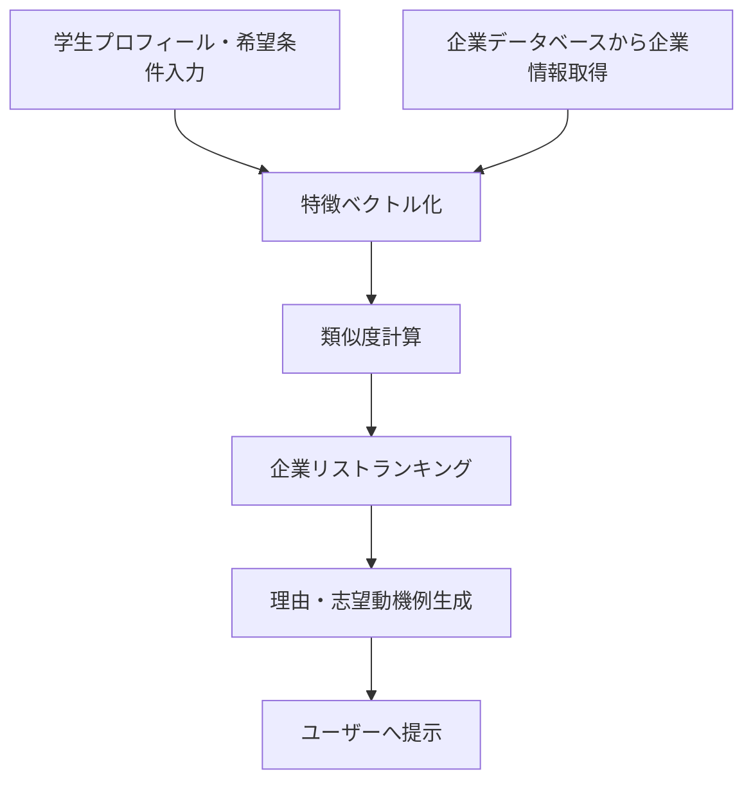

```mermaid
flowchart TD
    A[学生プロフィール・希望条件入力]
    B[企業データベースから企業情報取得]
    C[特徴ベクトル化]
    D[類似度計算]
    E[企業リストランキング]
    F[理由・志望動機例生成]
    G[ユーザーへ提示]

    A --> C
    B --> C
    C --> D
    D --> E
    E --> F
    F --> G
```
