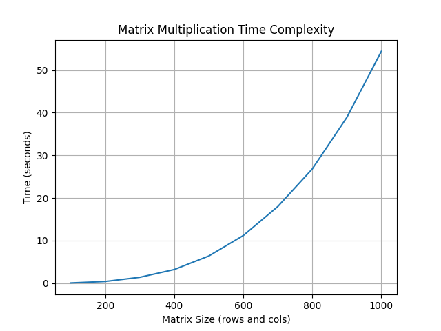

---
puppeteer:
  format: "A4"
  landscape: false
  background: "white"
  printBackground: true
  margin:
    top: 10mm
    bottom: 10mm
    left: 10mm
    right: 10mm
---

# 課題１

## プログラム

```python
import time
import matplotlib.pyplot as plt


def generate_matrix(rows, cols):
    u = [[(i + j) % 2 for j in range(cols)] for i in range(rows)]
    v = [[(i + j) % 2 for j in range(cols)] for i in range(rows)]
    return u, v


def matrix_multiplication(u, v):
    rows = len(u)
    cols = len(v[0])
    result = [[0] * cols for _ in range(rows)]

    for i in range(rows):
        for j in range(cols):
            for k in range(len(v)):
                result[i][j] += u[i][k] * v[k][j]

    return result


def main():
    max_size = 1000
    step = 100

    times = []
    sizes = []
    for size in range(step, max_size + 1, step):
        u, v = generate_matrix(size, size)
        start_time = time.time()
        matrix_multiplication(u, v)
        end_time = time.time()

        times.append(end_time - start_time)
        sizes.append(size)
        print(f"Size: {size}, Time: {end_time - start_time:.4f} seconds")

    plt.plot(sizes, times)
    plt.xlabel("Matrix Size (rows and cols)")
    plt.ylabel("Time (seconds)")
    plt.title("Matrix Multiplication Time Complexity")
    plt.grid()
    plt.savefig("matrix_multiplication_time_complexity.png")
    plt.show()


if __name__ == "__main__":
    main()
```

## 実行結果

```bash
Size: 100, Time: 0.0539 seconds
Size: 200, Time: 0.4038 seconds
Size: 300, Time: 1.3882 seconds
Size: 400, Time: 3.2138 seconds
Size: 500, Time: 6.3824 seconds
Size: 600, Time: 11.1876 seconds
Size: 700, Time: 17.9915 seconds
Size: 800, Time: 26.8226 seconds
Size: 900, Time: 38.9106 seconds
Size: 1000, Time: 54.4093 seconds
```



## 考察

実行結果のグラフを見ると、サイズが大きくなるにつれて計算時間が指数関数的に増加していることがわかる。また、数字での出力を見ると、サイズ100の時の実行時間をそれぞれのサイズと比較すると以下のようになる。

|    サイズの増加     |           実行時間の増加           |
| :-----------------: | :--------------------------------: |
| 100 → 200   （2倍） |  0.0539秒 → 0.4038秒   （7.47倍）  |
| 100 → 300   （3倍） |  0.0539秒 → 1.3882秒   （25.7倍）  |
| 100 → 400   （4倍） |  0.0539秒 → 3.2138秒   （59.6倍）  |
| 100 → 500   （5倍） | 0.0539秒 → 6.3824秒   （118.7倍）  |
| 100 → 600   （6倍） | 0.0539秒 → 11.1876秒  （207.5倍）  |
| 100 → 700   （7倍） | 0.0539秒 → 17.9915秒  （333.4倍）  |
| 100 → 800   （8倍） | 0.0539秒 → 26.8226秒  （496.5倍）  |
| 100 → 900   （9倍） | 0.0539秒 → 38.9106秒  （722.5倍）  |
| 100 → 1000（10倍）  | 0.0539秒 → 54.4093秒  （1015.4倍） |

2~10までの3乗の値はそれぞれ8, 27, 64, 125, 216, 343, 512, 729, 1000である。上記の実行時間の増加率は、サイズの増加率の3乗に近いことがわかる。

これは、正方行列同士の掛け算の計算量が、for文を3つネストさせることで$O(n^3)$になっているからである。

このことから、行列のサイズが大きくなると計算時間が急激に増加することがわかる。また、for文のネストを減らすことで、計算量を減らすことができると考える。
