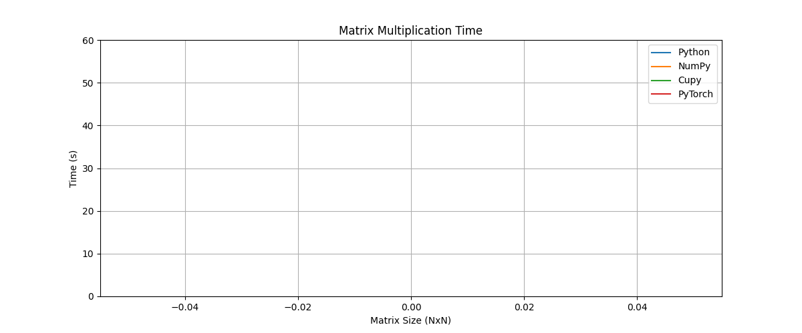
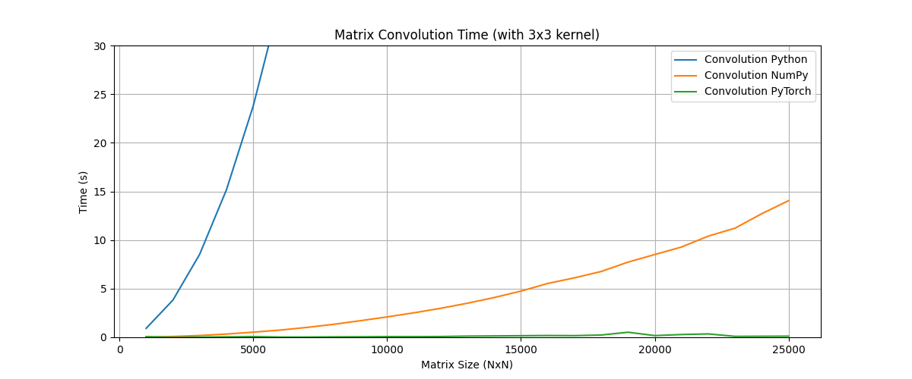

# 課題２

ok240100 藤村勇仁

## 概要

本課題では、2つの正方行列の積と正方行列と3×3行列の畳み込みそれぞれを求めるpythonプログラムを作成して、それぞれの行列サイズと実行時間の関係を調べる。また、python, numpy, pytorchの3つのライブラリを用いて、行列の積と畳み込みを行い、実行時間を比較する。

### 行列の積

２つの正方行列の積の計算のサイズと実行時間の関係を調べる。行列のサイズは200から200ずつ増加させ、pythonだけでの計算時間が60秒を超えたら1000ずつ増加させる。行列のサイズが大きくなるにつれて、実行時間がどのように変化するかを調べる。
また、行列のサイズが大きくなるとGPUメモリが不足するため、行列の最大サイズを25000とする。

#### 行列の積のプログラム

```python
import time
import numpy as np
import torch
import matplotlib.pyplot as plt
import gc


def generate_matrix_python(size):
    return [[(i + j) % 2 for j in range(size)] for i in range(size)]


def generate_matrix_np(size):
    return np.random.rand(size, size)


def generate_matrix_torch(size, device):
    return torch.rand(size, size).unsqueeze(0).unsqueeze(0).to(device)


def matrix_multiplication_python(u, v):
    size = len(u)
    result = [[0.0] * size for _ in range(size)]
    for i in range(size):
        for j in range(size):
            for k in range(size):
                result[i][j] += u[i][k] * v[k][j]
    return result


def matrix_multiplication_numpy(u, v):
    return np.dot(u, v)


def matrix_multiplication_torch(u, v):
    return torch.matmul(u, v)


def check_times(python_times, numpy_times, torch_times, time_limit):
    flag_python = python_times[-1] < time_limit
    flag_numpy = numpy_times[-1] < time_limit
    flag_torch = torch_times[-1] < time_limit
    return flag_python, flag_numpy, flag_torch


def benchmark():
    device = torch.device("cuda" if torch.cuda.is_available() else "cpu")
    step = 200
    time_limit = 60
    max_size = 25000

    python_times = []
    numpy_times = []
    torch_times = []
    multiple_sizes = []

    i = 0
    size = 0
    while True:
        flag_python, flag_numpy, flag_torch = (
            check_times(python_times, numpy_times, torch_times, time_limit)
            if i != 0
            else (True, True, True)
        )

        if not flag_python and not flag_numpy and not flag_torch:
            print("All methods exceeded the threshold.")
            break

        if size >= max_size:
            print("Maximum size reached.")
            break

        size += step if flag_python else step * 10
        multiple_sizes.append(size)

        print(f"Size: {size}", end=",\t")

        # Python
        if flag_python:
            u_py = generate_matrix_python(size)
            v_py = generate_matrix_python(size)
            start = time.time()
            matrix_multiplication_python(u_py, v_py)
            python_times.append(time.time() - start)
            print(f"Python: {python_times[-1]:.4f}s", end=",\t")
            del u_py, v_py
        else:
            python_times.append(python_times[-1])
            print("Python: --------", end=",\t")

        # NumPy
        if flag_numpy:
            u_np = generate_matrix_np(size)
            v_np = generate_matrix_np(size)
            start = time.time()
            matrix_multiplication_numpy(u_np, v_np)
            numpy_times.append(time.time() - start)
            print(f"NumPy: {numpy_times[-1]:.4f}s", end=", \t")
            del u_np, v_np
        else:
            numpy_times.append(numpy_times[-1])
            print("NumPy: --------", end=", \t")

        # PyTorch
        if flag_torch:
            u_th = generate_matrix_torch(size, device)
            v_th = generate_matrix_torch(size, device)
            start = time.time()
            matrix_multiplication_torch(u_th, v_th)
            torch_times.append(time.time() - start)
            print(f"PyTorch: {torch_times[-1]:.4f}s")
            del u_th, v_th
            torch.cuda.empty_cache()
        else:
            torch_times.append(torch_times[-1])
            print("PyTorch: --------")

        gc.collect()
        i += 1

    # === Plotting ===
    plt.figure(figsize=(12, 5))
    plt.plot(multiple_sizes, python_times, label="Python")
    plt.plot(multiple_sizes, numpy_times, label="NumPy")
    plt.plot(multiple_sizes, torch_times, label="PyTorch")
    plt.title("Matrix Multiplication Time")
    plt.xlabel("Matrix Size (NxN)")
    plt.ylabel("Time (s)")
    plt.ylim(0, time_limit)
    plt.legend()
    plt.grid()
    plt.savefig("matrix_multiplication_time.png")
    plt.show()


if __name__ == "__main__":
    benchmark()
```

#### 行列の積の実行結果

```bash
Size: 200,      Python: 0.5273s,        NumPy: 0.0020s,         PyTorch: 0.0217s
Size: 400,      Python: 4.3050s,        NumPy: 0.0030s,         PyTorch: 0.0010s
Size: 600,      Python: 14.2432s,       NumPy: 0.0060s,         PyTorch: 0.0000s
Size: 800,      Python: 36.1639s,       NumPy: 0.0089s,         PyTorch: 0.0000s
Size: 1000,     Python: 72.8174s,       NumPy: 0.0380s,         PyTorch: 0.0000s
Size: 3000,     Python: --------,       NumPy: 0.7636s,         PyTorch: 0.0011s
Size: 5000,     Python: --------,       NumPy: 2.6416s,         PyTorch: 0.0020s
Size: 7000,     Python: --------,       NumPy: 7.1806s,         PyTorch: 0.0010s
Size: 9000,     Python: --------,       NumPy: 15.0878s,        PyTorch: 0.0090s
Size: 11000,    Python: --------,       NumPy: 31.8392s,        PyTorch: 0.0045s
Size: 13000,    Python: --------,       NumPy: 52.3198s,        PyTorch: 0.0070s
Size: 15000,    Python: --------,       NumPy: 73.8038s,        PyTorch: 0.0040s
Size: 17000,    Python: --------,       NumPy: --------,        PyTorch: 0.0058s
Size: 19000,    Python: --------,       NumPy: --------,        PyTorch: 0.0100s
Size: 21000,    Python: --------,       NumPy: --------,        PyTorch: 0.0050s
Size: 23000,    Python: --------,       NumPy: --------,        PyTorch: 0.0105s
Size: 25000,    Python: --------,       NumPy: --------,        PyTorch: 0.0102s
Maximum size reached.
```



### 畳み込み

正方行列と3×3行列の畳み込みの計算のサイズと実行時間の関係を調べる。行列のサイズは1000から1000ずつ増加させていく。行列のサイズが大きくなるにつれて、実行時間がどのように変化するかを調べる。
また、行列のサイズが大きくなるとGPUメモリが不足するため、行列の最大サイズを25000とする。

#### 畳み込みのプログラム

```python
import time
import numpy as np
import torch
import matplotlib.pyplot as plt
import gc
from scipy.signal import convolve2d


def generate_matrix(size):
    return [[(i + j) % 2 for j in range(size)] for i in range(size)]


def generate_matrix_np(size):
    return np.array(
        [[1 if (i + j) % 2 == 0 else 0 for j in range(size)] for i in range(size)]
    )


def generate_matrix_torch(size, device):
    return (
        (
            torch.tensor(
                [
                    [1 if (i + j) % 2 == 0 else 0 for j in range(size)]
                    for i in range(size)
                ]
            )
            .unsqueeze(0)
            .unsqueeze(0)
        )
        .to(device)
        .float()
    )


def convolution_python(img, kernel):
    h, w = len(img), len(img[0])
    kh, kw = len(kernel), len(kernel[0])
    output = [[0.0 for _ in range(w - kw + 1)] for _ in range(h - kh + 1)]

    for i in range(h - kh + 1):
        for j in range(w - kw + 1):
            for ki in range(kh):
                for kj in range(kw):
                    output[i][j] += img[i + ki][j + kj] * kernel[ki][kj]
    return output


def convolution_numpy(img, kernel):
    return convolve2d(img, kernel, mode="valid")


def convolution_torch(img, kernel):
    result = torch.nn.functional.conv2d(img, kernel, padding=0)
    torch.cuda.synchronize()
    return result


def check_times(python_times, numpy_times, torch_times, time_limit):
    flag_python = python_times[-1] < time_limit
    flag_numpy = numpy_times[-1] < time_limit
    flag_torch = torch_times[-1] < time_limit
    return flag_python, flag_numpy, flag_torch


def benchmark():
    device = torch.device("cuda" if torch.cuda.is_available() else "cpu")
    step = 1000
    time_limit = 30
    max_size = 25000

    kernel_py = [[1 / 9.0] * 3 for _ in range(3)]
    kernel_np = np.ones((3, 3)) / 9.0
    kernel_torch = torch.tensor(kernel_np).unsqueeze(0).unsqueeze(0).to(device).float()
    kernel_torch = kernel_torch.view(1, 1, kernel_torch.shape[2], kernel_torch.shape[3])

    python_times = []
    numpy_times = []
    torch_times = []
    conv_sizes = []

    i = 0
    size = 0
    while True:
        flag_python, flag_numpy, flag_torch = (
            check_times(python_times, numpy_times, torch_times, time_limit)
            if i != 0
            else (True, True, True)
        )

        if not flag_python and not flag_numpy and not flag_torch:
            print("All methods exceeded the threshold.")
            break

        if size >= max_size:
            print("Maximum size reached.")
            break

        size += step
        conv_sizes.append(size)

        print(f"Size: {size}", end=",\t")

        # Python
        if flag_python:
            u_py = generate_matrix(size)
            start = time.time()
            convolution_python(u_py, kernel_py)
            python_times.append(time.time() - start)
            del u_py
            print(f"Python: {python_times[-1]:.4f}s", end=", \t")
        else:
            python_times.append(python_times[-1])
            print("Python: --------", end=", \t")

        # NumPy
        if flag_numpy:
            u_np = generate_matrix_np(size)
            start = time.time()
            convolution_numpy(u_np, kernel_np)
            numpy_times.append(time.time() - start)
            del u_np
            print(f"NumPy: {numpy_times[-1]:.4f}s", end=", \t")
        else:
            numpy_times.append(numpy_times[-1])
            print("NumPy: --------", end=", \t")

        # PyTorch
        if flag_torch:
            u_torch = generate_matrix_torch(size, device)
            start = time.time()
            convolution_torch(u_torch, kernel_torch)
            torch_times.append(time.time() - start)
            del u_torch
            torch.cuda.empty_cache()
            print(f"PyTorch: {torch_times[-1]:.4f}s")
        else:
            torch_times.append(torch_times[-1])
            print("PyTorch: --------")

        gc.collect()
        i += 1

    plt.figure(figsize=(12, 5))
    plt.plot(conv_sizes, python_times, label="Convolution Python")
    plt.plot(conv_sizes, numpy_times, label="Convolution NumPy")
    plt.plot(conv_sizes, torch_times, label="Convolution PyTorch")
    plt.title("Matrix Convolution Time (with 3x3 kernel)")
    plt.xlabel("Matrix Size (NxN)")
    plt.ylabel("Time (s)")
    plt.ylim(0, time_limit)
    plt.legend()
    plt.grid()
    plt.savefig("matrix_convolution_time.png")
    plt.show()


if __name__ == "__main__":
    benchmark()
```

#### 畳み込みの実行結果

```bash
Size: 1000,     Python: 0.9203s,        NumPy: 0.0210s,         PyTorch: 0.0690s
Size: 2000,     Python: 3.8205s,        NumPy: 0.0831s,         PyTorch: 0.0010s
Size: 3000,     Python: 8.5375s,        NumPy: 0.1862s,         PyTorch: 0.0246s
Size: 4000,     Python: 15.1681s,       NumPy: 0.3339s,         PyTorch: 0.0465s
Size: 5000,     Python: 23.7795s,       NumPy: 0.5282s,         PyTorch: 0.0745s
Size: 6000,     Python: 34.5654s,       NumPy: 0.7412s,         PyTorch: 0.0290s
Size: 7000,     Python: --------,       NumPy: 1.0166s,         PyTorch: 0.0280s
Size: 8000,     Python: --------,       NumPy: 1.3347s,         PyTorch: 0.0475s
Size: 9000,     Python: --------,       NumPy: 1.7073s,         PyTorch: 0.0551s
Size: 10000,    Python: --------,       NumPy: 2.0961s,         PyTorch: 0.0732s
Size: 11000,    Python: --------,       NumPy: 2.5165s,         PyTorch: 0.0690s
Size: 12000,    Python: --------,       NumPy: 2.9811s,         PyTorch: 0.0792s
Size: 13000,    Python: --------,       NumPy: 3.5034s,         PyTorch: 0.1228s
Size: 14000,    Python: --------,       NumPy: 4.0866s,         PyTorch: 0.1420s
Size: 15000,    Python: --------,       NumPy: 4.7496s,         PyTorch: 0.1635s
Size: 16000,    Python: --------,       NumPy: 5.5337s,         PyTorch: 0.1845s
Size: 17000,    Python: --------,       NumPy: 6.1149s,         PyTorch: 0.1722s
Size: 18000,    Python: --------,       NumPy: 6.7680s,         PyTorch: 0.2348s
Size: 19000,    Python: --------,       NumPy: 7.7290s,         PyTorch: 0.5208s
Size: 20000,    Python: --------,       NumPy: 8.5130s,         PyTorch: 0.1756s
Size: 21000,    Python: --------,       NumPy: 9.2836s,         PyTorch: 0.2858s
Size: 22000,    Python: --------,       NumPy: 10.4043s,        PyTorch: 0.3495s
Size: 23000,    Python: --------,       NumPy: 11.2239s,        PyTorch: 0.0967s
Size: 24000,    Python: --------,       NumPy: 12.7159s,        PyTorch: 0.1070s
Size: 25000,    Python: --------,       NumPy: 14.0474s,        PyTorch: 0.1167s
Maximum size reached.
```


