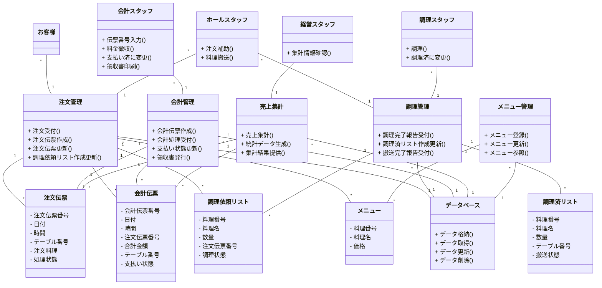

```mermaid
classDiagram
    class お客様
    class ホールスタッフ {
        + 注文補助()
        + 料理搬送()
    }
    class 調理スタッフ {
        + 調理()
        + 調理済に変更()
    }
    class 会計スタッフ {
        + 伝票番号入力()
        + 料金徴収()
        + 支払い済に変更()
        + 領収書印刷()
    }
    class 経営スタッフ {
        + 集計情報確認()
    }

    class 注文伝票 {
        - 注文伝票番号
        - 日付
        - 時間
        - テーブル番号
        - 注文料理
        - 処理状態
    }
    class 会計伝票 {
        - 会計伝票番号
        - 日付
        - 時間
        - 注文伝票番号
        - 合計金額
        - テーブル番号
        - 支払い状態
    }
    class メニュー {
        - 料理番号
        - 料理名
        - 価格
    }
    class 調理依頼リスト {
        - 料理番号
        - 料理名
        - 数量
        - 注文伝票番号
        - 調理状態
    }
    class 調理済リスト {
        - 料理番号
        - 料理名
        - 数量
        - テーブル番号
        - 搬送状態
    }

    class 注文管理 {
        + 注文受付()
        + 注文伝票作成()
        + 注文伝票更新()
        + 調理依頼リスト作成更新()
    }
    class 調理管理 {
        + 調理完了報告受付()
        + 調理済リスト作成更新()
        + 搬送完了報告受付()
    }
    class 会計管理 {
        + 会計伝票作成()
        + 会計処理受付()
        + 支払い状態更新()
        + 領収書発行()
    }
    class 売上集計 {
        + 売上集計()
        + 統計データ生成()
        + 集計結果提供()
    }
    class メニュー管理 {
        + メニュー登録()
        + メニュー更新()
        + メニュー参照()
    }
    class データベース {
        + データ格納()
        + データ取得()
        + データ更新()
        + データ削除()
    }

    お客様 "*" -- "1" 注文管理
    ホールスタッフ "*" -- "1" 注文管理
    ホールスタッフ "*" -- "1" 調理管理
    調理スタッフ "*" -- "1" 調理管理
    会計スタッフ "*" -- "1" 会計管理
    経営スタッフ "*" -- "1" 売上集計

    注文管理 "1" -- "*" 注文伝票
    注文管理 "1" -- "*" 会計伝票
    注文管理 "1" -- "*" 調理依頼リスト
    注文管理 "1" -- "*" メニュー
    注文管理 "*" -- "1" データベース

    調理管理 "1" -- "*" 調理依頼リスト
    調理管理 "1" -- "*" 調理済リスト
    調理管理 "*" -- "1" データベース

    会計管理 "1" -- "*" 会計伝票
    会計管理 "1" -- "*" 注文伝票
    会計管理 "*" -- "1" データベース

    売上集計 "1" -- "*" 注文伝票
    売上集計 "1" -- "*" 会計伝票
    売上集計 "*" -- "1" データベース

    メニュー管理 "1" -- "*" メニュー
    メニュー管理 "*" -- "1" データベース
```
