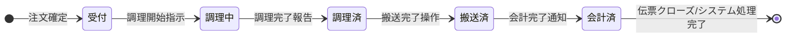

```mermaid
stateDiagram-v2
    direction LR
    [*] --> 受付 : 注文確定
    受付 --> 調理中 : 調理開始指示
    調理中 --> 調理済 : 調理完了報告
    調理済 --> 搬送済 : 搬送完了操作
    搬送済 --> 会計済 : 会計完了通知
    会計済 --> [*] : 伝票クローズ/システム処理完了
```
